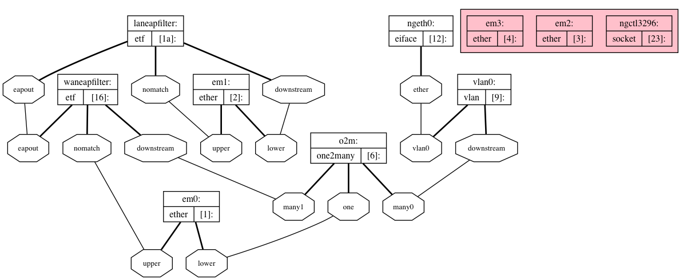

# About

This repository includes my notes on enabling a true bridge mode setup with AT&T U-Verse and pfSense. This method utilizes [netgraph](https://www.freebsd.org/cgi/man.cgi?netgraph(4)) which is a graph based kernel networking subsystem of FreeBSD. This low-level solution was required to account for the unique issues surrounding bridging 802.1X traffic and tagging a VLAN with an id of 0. I've tested and confirmed this setup works with AT&T U-Verse Internet on the ARRIS NVG589, NVG599 and BGW210-700 residential gateways (probably others too). For Pace 5268AC see special details below.

There are a few other methods to accomplish true bridge mode, so be sure to see what easiest for you. True Bridge Mode is also possible in a Linux via ebtables or using hardware with a VLAN swap trick. For me, I was not using a Linux-based router and the VLAN swap did not seem to work for me.

While many AT&T residential gateways offer something called _IP Passthrough_, it does not provide the same advantages of a true bridge mode. For example, the NAT table is still managed by the gateway, which is limited to a measly 8192 sessions (although it becomes unstable at even 60% capacity).

The netgraph method will allow you to fully utilize your own router and fully bypass your residential gateway. It survives reboots, re-authentications, IPv6, and new DHCP leases.

# How it Works

Before continuing to the setup, it's important to understand how this method works. This will make configuration and troubleshooting much easier.

## Standard Procedure

First, let's talk about what happens in the standard setup (without any bypass). At a high level, the following process happens when the gateway boots up:

1. All traffic on the ONT is protected with [802.1/X](https://en.wikipedia.org/wiki/IEEE_802.1X). So in order to talk to anything, the Router Gateway must first perform the [authentication procedure](https://en.wikipedia.org/wiki/IEEE_802.1X#Typical_authentication_progression). This process uses a unique certificate that is hardcoded on your residential gateway.
2. Once the authentication completes, you'll be able to properly "talk" to the outside. However, all of your traffic will need to be tagged with VLAN ID 0 (a.k.a. VLAN Priority Tagging<sup>[[1]](https://wikipedia.org/wiki/IEEE_802.1Q#Frame_format)[[2]](https://www.cisco.com/c/en/us/td/docs/switches/connectedgrid/cg-switch-sw-master/software/configuration/guide/vlan0/b_vlan_0.html)</sup>) before the IP gateway will respond.  
3. Once traffic is tagged with VLAN0, your residential gateway needs to request a public IPv4 address via DHCP. The MAC address in the DHCP request needs to match that of the MAC address that's assigned to your AT&T account. Other than that, there's nothing special about the DCHPv4 handshake.
4. After the DHCP lease is issued, the WAN setup is complete. Your LAN traffic is then NAT'd and routed to the outside.

## Bypass Procedure

To bypass the gateway using pfSense, we can emulate the standard procedure. If we connect our Residential Gateway and ONT to our pfSense box, we can bridge the 802.1/X authentication sequence, tag our WAN traffic as VLAN0, and request a public IPv4 via DHCP using a spoofed MAC address.

Unfortunately, there are some challenges with emulating this process. First, it's against RFC to bridge 802.1/X traffic and it is not supported. Second, tagging traffic as VLAN0 is not supported through the standard interfaces.

This is where netgraph comes in. Netgraph allows you to break some rules and build the proper plumbing to make this work. So, our cabling looks like this:

```
Residential Gateway
[ONT Port]
  |
  |
[nic0] pfSense [nic1]
                 |
                 |
               [ONT]
              Outside
```

With netgraph, our procedure looks like this (at a high level):

1. The Residential Gateway initiates a 802.1/X EAPOL-START.
1. The packet then is bridged through netgraph to the ONT interface.
1. If the packet matches an 802.1/X type (which is does), it is passed to the ONT interface. If it does not, the packet is discarded. This prevents our Residential Gateway from initiating DHCP. We want pfSense to handle that.
1. The ONT should then see and respond to the EAPOL-START, which is passed back through our netgraph back to the residential gateway. At this point, the 802.1/X authentication should be complete.
1. netgraph has also created an interface for us called `ngeth0`. This interface is connected to `ng_vlan` which is configured to tag all traffic as VLAN0 before sending it on to the ONT interface.
1. pfSense can then be configured to use `ngeth0` as the WAN interface.
1. Next, we spoof the MAC address of the residential gateway and request a DHCP lease on `ngeth0`. The packets get tagged as VLAN0 and exit to the ONT.
1. Now the DHCP handshake should complete and we should be on our way!

Hopefully, that now gives you an idea of what we are trying to accomplish. See the comments and commands `bin/pfatt.sh` for details about the netgraph setup.

But enough talk. Now for the fun part!

# Setup

## Prerequisites

* At least __three__ physical network interfaces on your pfSense server
* The MAC address of your Residential Gateway
* Local or console access to pfSense
* pfSense 2.4.5 running on amd64 architecture _(If you are running pfSense 2.4.4 please see instruction in the [Before-pfSense-2.4.5 branch](https://github.com/MonkWho/pfatt/blob/Before-pfSense-2.4.5/README.md))_

At this time there is a bug in pFsense 2.4.5 and [ng_etf module is only included in pFsense 2.4.5 _amd64 build_](
https://redmine.pfsense.org/issues/10463). Should be fixed in 2.4.5-p1.

PFSense Builds for Netgate hardware may not include ng_etf (Confimred on SG4860-Desktop 2.4.5-p1). Confirm ng_etf exists before continuing and look at [Before-pfSense-2.4.5 branch](https://github.com/MonkWho/pfatt/blob/Before-pfSense-2.4.5/README.md) for gudiance if it doesn't exist.

If you are running pfSense on anything other than amd64 architecture you should compile your own version of ng_etf. Look at [Before-pfSense-2.4.5 branch](https://github.com/MonkWho/pfatt/blob/Before-pfSense-2.4.5/README.md) for some guidance on compiling and running your own ng_etf.

If you only have two NICs, you can buy this cheap USB 100Mbps NIC [from Amazon](https://www.amazon.com/gp/product/B00007IFED) as your third. It has the Asix AX88772 chipset, which is supported in FreeBSD with the [axe](https://www.freebsd.org/cgi/man.cgi?query=axe&sektion=4) driver. I've confirmed it works in my setup. The driver was already loaded and I didn't have to install or configure anything to get it working. Also, don't worry about the poor performance of USB or 100Mbps NICs. This third NIC will only send/recieve a few packets periodicaly to authenticate your Router Gateway. The rest of your traffic will utilize your other (and much faster) NICs.

## Install

1. Edit the following configuration variables in `bin/pfatt.sh` as noted below. `$RG_ETHER_ADDR` should match the MAC address of your Residential Gateway. AT&T will only grant a DHCP lease to the MAC they assigned your device. In my environment, it's:
    ```shell
    ONT_IF='xx0' # NIC -> ONT / Outside
    RG_IF='xx1'  # NIC -> Residential Gateway's ONT port
    RG_ETHER_ADDR='xx:xx:xx:xx:xx:xx' # MAC address of Residential Gateway
    ```

2. Copy `bin/pfatt.sh` to `/root/bin` (or any directory):
    ```
    ssh root@pfsense mkdir /root/bin
    scp bin/pfatt.sh root@pfsense:/root/bin/
    ssh root@pfsense chmod +x /root/bin/pfatt.sh
    ```

    **NOTE:** If you have the 5268AC, you'll also need to install `pfatt-5268AC-startup.sh` and `pfatt-5268.sh`. The scripts monitor your connection and disable or enable the EAP bridging as needed. It's a hacky workaround, but it enables you to keep your 5268AC connected, avoid EAP-Logoffs and survive reboots. Consider changing the `PING_HOST` in `pfatt-5268AC.sh` to a reliable host. Then perform these additional steps to install:
    ```
    scp bin/pfatt-5268AC-startup.sh root@pfsense:/usr/local/etc/rc.d/pfatt-5268AC-startup.sh
    scp bin/pfatt-5268AC.sh root@pfsense:/root/bin/
    ssh root@pfsense chmod +x /usr/local/etc/rc.d/pfatt-5268AC-startup.sh /root/bin/pfatt-5268AC.sh
    ```

3. To start pfatt.sh script at the beginning of the boot process pfSense team recomments you use a package called shellcmd. Use pfSense package installer to find and install it. Once you have shellcmd package installed you can find it in Services > Shellcmd. Now add a new command and fill it up accordingly (make sure to select earlyshellcmd from a dropdown):
    ```
    Command: /root/bin/pfatt.sh
    Shellcmd Type: earlyshellcmd
    ```
    It should look like this:
    

    This can also be acomplished by manually editing your pfSense /conf/config.xml file. Add <earlyshellcmd>/root/bin/pfatt.sh</earlyshellcmd> above </system>. This method is not recommended and is frowned upon by pfSense team.

4. Connect cables:
    - `$RG_IF` to Residential Gateway on the ONT port (not the LAN ports!)
    - `$ONT_IF` to ONT (outside)
    - `LAN NIC` to local switch (as normal)

5. Prepare for console access.
6. Reboot.
7. pfSense will detect new interfaces on bootup. Follow the prompts on the console to configure `ngeth0` as your pfSense WAN. Your LAN interface should not normally change. However, if you moved or re-purposed your LAN interface for this setup, you'll need to re-apply any existing configuration (like your VLANs) to your new LAN interface. pfSense does not need to manage `$RG_IF` or `$ONT_IF`. I would advise not enabling those interfaces in pfSense as it can cause problems with the netgraph.
8. In the webConfigurator, configure the  WAN interface (`ngeth0`) to DHCP using the MAC address of your Residential Gateway.

If everything is setup correctly, netgraph should be bridging EAP traffic between the ONT and RG, tagging the WAN traffic with VLAN0, and your WAN interface configured with an IPv4 address via DHCP.

# IPv6 Setup

Once your netgraph setup is in place and working, there aren't any netgraph changes required to the setup to get IPv6 working. These instructions can also be followed with a different bypass method other than the netgraph method. Big thanks to @pyrodex1980's [post](http://www.dslreports.com/forum/r32118263-) on DSLReports for sharing your notes.

This setup assumes you have a fairly recent version of pfSense. I'm using 2.4.5.

**DUID Setup**

1. Go to _System > Advanced > Networking_
1. Configure **DHCP6 DUID** to _DUID-EN_
1. Configure **DUID-EN** to _3561_
1. Configure your **IANA Private Enterprise Number**. This number is unique for each customer and (I believe) based off your Residential Gateway serial number. You can generate your DUID using [gen-duid.sh](https://github.com/MonkWho/pfatt/blob/master/bin/gen-duid.sh), which just takes a few inputs. Or, you can take a pcap of the Residential Gateway with some DHCPv6 traffic. Then fire up Wireshark and look for the value in _DHCPv6 > Client Identifier > Identifier_. Add the value as colon separated hex values `00:00:00`.
1. Save

**WAN Setup**

1. Go to _Interfaces > WAN_
1. Enable **IPv6 Configuration Type** as _DHCP6_
1. Scroll to _DCHP6 Client Configuration_
1. Enable **Request only an IPv6 prefix**
1. Enable **DHCPv6 Prefix Delegation size** as _60_
1. Enable _Send IPv6 prefix hint_
1. Enable _Do not wait for a RA_
1. Save

**LAN Setup**

1. Go to _Interfaces > LAN_
1. Change the **IPv6 Configuration Type** to _Track Interface_
1. Under Track IPv6 Interface, assign **IPv6 Interface** to your WAN interface.
1. Configure **IPv6 Prefix ID** to _1_. We start at _1_ and not _0_ because pfSense will use prefix/address ID _0_ for itself and it seems AT&T is flakey about assigning IPv6 prefixes when a request is made with a prefix ID that matches the prefix/address ID of the router.
1. Save

If you have additional LAN interfaces repeat these steps for each interface except be sure to provide an **IPv6 Prefix ID** that is not _0_ and is unique among the interfaces you've configured so far.

**DHCPv6 Server & RA**

1. Go to _Services > DHCPv6 Server & RA_
1. Enable DHCPv6 server on interface LAN
1. Configure a range of ::0001 to ::ffff:ffff:ffff:fffe
1. Leave **Prefix Delegation Range** _blank_.
1. Configure **Prefix Delegation Size** to _64_
1. Save
1. Go to the _Router Advertisements_ tab
1. Configure **Router mode** as _Stateless DHCP_
1. Save

If you have additional LAN interfaces repeat these steps for each interface.

That's it! Now your clients should be receiving public IPv6 addresses via DHCP6.

# Troubleshooting

## Logging

Output from `pfatt.sh` and `pfatt-5268AC.sh` can be found in `/var/log/pfatt.log`.

## tcpdump

Use tcpdump to watch the authentication, vlan and dhcp bypass process (see above). Run tcpdumps on the `$ONT_IF` interface and the `$RG_IF` interface:
```
tcpdump -ei $ONT_IF
tcpdump -ei $RG_IF
```

Restart your Residential Gateway. From the `$RG_IF` interface, you should see some EAPOL starts like this:
```
MAC (oui Unknown) > MAC (oui Unknown), ethertype EAPOL (0x888e), length 60: POL start
```

If you don't see these, make sure you're connected to the ONT port.

These packets come every so often. I think the RG does some backoff / delay if doesn't immediately auth correctly. You can always reboot your RG to initiate the authentication again.

If your netgraph is setup correctly, the EAP start packet from the `$RG_IF` will be bridged onto your `$ONT_IF` interface. Then you should see some more EAP packets from the `$ONT_IF` interface and `$RG_IF` interface as they negotiate 802.1/X EAP authentication.

Once that completes, watch `$ONT_IF` and `ngeth0` for DHCP traffic.
```
tcpdump -ei $ONT_IF port 67 or port 68
tcpdump -ei ngeth0 port 67 or port 68
```

Verify you are seeing 802.1Q (tagged as vlan0) traffic on your `$ONT_IF ` interface and untagged traffic on `ngeth0`.

Verify the DHCP request is firing using the MAC address of your Residential Gateway.

If the VLAN0 traffic is being properly handled, next pfSense will need to request an IP. `ngeth0` needs to DHCP using the authorized MAC address. You should see an untagged DCHP request on `ngeth0` carry over to the `$ONT_IF` interface tagged as VLAN0. Then you should get a DHCP response and you're in business.

If you don't see traffic being bridged between `ngeth0` and `$ONT_IF`, then netgraph is not setup correctly.

## Promiscuous Mode

`pfatt.sh` will put `$RG_IF` in promiscuous mode via `/sbin/ifconfig $RG_IF promisc`. Otherwise, the EAP packets would not bridge. I think this is necessary for everyone but I'm not sure. Turn it off if it's causing issues.

## netgraph

The netgraph system provides a uniform and modular system for the implementation of kernel objects which perform various networking functions. If you're unfamiliar with netgraph, this [tutorial](http://www.netbsd.org/gallery/presentations/ast/2012_AsiaBSDCon/Tutorial_NETGRAPH.pdf) is a great introduction.

Your netgraph should look something like this:



In this setup, the `ue0` interface is my `$RG_IF` and the `bce0` interface is my `$ONT_IF`. You can generate your own graphviz via `ngctl dot`. Copy the output and paste it at [webgraphviz.com](http://www.webgraphviz.com/).

Try these commands to inspect whether netgraph is configured properly.

1. Confirm kernel modules are loaded with `kldstat -v`. The following modules are required:
    - netgraph
    - ng_ether
    - ng_eiface
    - ng_one2many
    - ng_vlan
    - ng_etf

2. Issue `ngctl list` to list netgraph nodes. Inspect `pfatt.sh` to verify the netgraph output matches the configuration in the script. It should look similar to this:
```
$ ngctl list
There are 9 total nodes:
  Name: o2m             Type: one2many        ID: 000000a0   Num hooks: 3
  Name: vlan0           Type: vlan            ID: 000000a3   Num hooks: 2
  Name: ngeth0          Type: eiface          ID: 000000a6   Num hooks: 1
  Name: <unnamed>       Type: socket          ID: 00000006   Num hooks: 0
  Name: ngctl28740      Type: socket          ID: 000000ca   Num hooks: 0
  Name: waneapfilter    Type: etf             ID: 000000aa   Num hooks: 2
  Name: laneapfilter    Type: etf             ID: 000000ae   Num hooks: 3
  Name: bce0            Type: ether           ID: 0000006e   Num hooks: 1
  Name: ue0             Type: ether           ID: 00000016   Num hooks: 2
```
3. Inspect the various nodes and hooks. Example for `ue0`:
```
$ ngctl show ue0:
  Name: ue0             Type: ether           ID: 00000016   Num hooks: 2
  Local hook      Peer name       Peer type    Peer ID         Peer hook
  ----------      ---------       ---------    -------         ---------
  upper           laneapfilter    etf          000000ae        nomatch
  lower           laneapfilter    etf          000000ae        downstream
```

### Reset netgraph

`pfatt.sh` expects a clean netgraph before it can be ran. To reset a broken netgraph state, try this:

```shell
/usr/sbin/ngctl shutdown waneapfilter:
/usr/sbin/ngctl shutdown laneapfilter:
/usr/sbin/ngctl shutdown $ONT_IF:
/usr/sbin/ngctl shutdown $RG_IF:
/usr/sbin/ngctl shutdown o2m:
/usr/sbin/ngctl shutdown vlan0:
/usr/sbin/ngctl shutdown ngeth0:
```

## pfSense

In some circumstances, pfSense may alter your netgraph. This is especially true if pfSense manages either your `$RG_IF` or `$ONT_IF`. If you make some interface changes and your connection breaks, check to see if your netgraph was changed.

# Virtualization Notes

This setup has been tested on physical servers and virtual machines. Virtualization adds another layer of complexity for this setup, and will take extra consideration.

## QEMU / KVM / Proxmox

Proxmox uses a bridged networking model, and thus utilizes Linux's native bridge capability. To use this netgraph method, you do a PCI passthrough for the `$RG_IF` and `$ONT_IF` NICs. The bypass procedure should then be the same.

You can also solve the EAP/802.1X and VLAN0/802.1Q problem by setting the `group_fwd_mask` and creating a vlan0 interface to bridge to your VM. See *Other Methods* below.

## ESXi

I haven't tried to do this with ESXi. Feel free to submit a PR with notes on your experience. PCI passthrough is probably the best approach here though.

# Other Methods

## Linux

If you're looking how to do this on a Linux-based router, please refer to [this method](http://blog.0xpebbles.org/Bypassing-At-t-U-verse-hardware-NAT-table-limits) which utilizes ebtables and some kernel features.  The method is well-documented there and I won't try to duplicate it. This method is generally more straight forward than doing this on BSD. However, please submit a PR for any additional notes for running on Linux routers.

## VLAN Swap

There is a whole thread on this at [DSLreports](http://www.dslreports.com/forum/r29903721-AT-T-Residential-Gateway-Bypass-True-bridge-mode). The gist of this method is that you connect your ONT, RG and WAN to a switch. Create two VLANs. Assign the ONT and RG to VLAN1 and the WAN to VLAN2. Let the RG authenticate, then change the ONT VLAN to VLAN2. The WAN the DHCPs and your in business.

However, I don't think this works for everyone. I had to explicitly tag my WAN traffic to VLAN0 which wasn't supported on my switch.

## OPNSense / FreeBSD
For OPNSense 20.1:
follow the pfSense instructions, EXCEPT:
1) use file opnatt.sh
2) do *NOT* install the ng_etf.ko, as OPNSense already has this module installed.
3) put the opnatt.sh script into `/usr/local/etc/rc.syshook.d/early` as `99-opnatt.sh`
4) do *NOT* modify config.xml, nor do any of the duid stuff
5) note: You *CAN* use IPv6 Prefix id 0, as OPNSense does *NOT* assign a routeable IPv6 address to ngeth0

I haven't tried this with native FreeBSD, but I imagine the process is ultimately the same with netgraph. Feel free to submit a PR with notes on your experience.

# U-verse TV

See [U-VERSE_TV.md](U-VERSE_TV.md)

# References

- http://blog.0xpebbles.org/Bypassing-At-t-U-verse-hardware-NAT-table-limits
- https://forum.netgate.com/topic/99190/att-uverse-rg-bypass-0-2-btc/
- http://www.dslreports.com/forum/r29903721-AT-T-Residential-Gateway-Bypass-True-bridge-mode
- https://www.dslreports.com/forum/r32127305-True-Bridge-mode-on-pfSense-with-netgraph
- https://www.dslreports.com/forum/r32116977-AT-T-Fiber-RG-Bypass-pfSense-IPv6
- http://www.netbsd.org/gallery/presentations/ast/2012_AsiaBSDCon/Tutorial_NETGRAPH.pdf

# Credits

This took a lot of testing and a lot of hours to figure out. A unique solution was required for this to work in pfSense. If this helped you out, please buy us a coffee.

- [rajl](https://forum.netgate.com/user/rajl) - for the netgraph idea - 1H8CaLNXembfzYGDNq1NykWU3gaKAjm8K5
- [pyrodex](https://www.dslreports.com/profile/1717952) - for IPv6 - ?
- [aus](https://github.com/aus) - 31m9ujhbsRRZs4S64njEkw8ksFSTTDcsRU
- [/u/MisterBazz](https://www.reddit.com/user/MisterBazz/) - [for the initial setup guide on U-verse TV documentation](https://www.reddit.com/r/PFSENSE/comments/ag43rb/att_bgw210_true_independent_bridge_mode_uverse/) that formed the basis for [U-VERSE_TV.md](U-VERSE_TV.md)
- [0xC0ncord](https://github.com/0xC0ncord) - for the [U-Verse TV Documentation](U-VERSE_TV.md)
